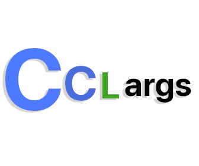

<div align="center">
  <br /><br />
  
  <br /><br />
</div>

----

<div id="user-content-toc" align="center">
  <ul>
    <summary><h1 style="display: inline-block;">Cclargs</h1></summary>
  </ul>

  <p>
    A minimalistic C library for intuitive command line argument parsing. Designed for simplicity, built for functionality.
    <br />
    <a href="https://github.com/ZackeryRSmith/Cclarg/issues/new?assignees=&labels=bug&projects=&template=bug_report.md&title=%5BBUG%5D+title+here"><b>Report Bug</b></a>
    ·
    <a href="https://github.com/ZackeryRSmith/Cclarg/issues/new?assignees=&labels=enhancement&projects=&template=feature_request.md&title=%5BREQUEST%5D+title+here"><b>Request a Feature</b></a>
    ·
    <a href="./cat.c"><b>Example Code</b></a>
  </p>
</div>

<p align="center">
  <a href="#features">Features</a>
</p>

<br />

----

<br />

# Features
* [Intuitive Parsing](#intuitive-parsing)
* [Flag Support](#flag-support)
* [Positional Argument Support](#positional-argument-support)
* [Auto-generating Help Menu](#auto-generating-help-menu)
* [Error Handling](#error-handling)
* [Lightweight and Single Header-only](#lightweight-and-single-header-only)


## Intuitive Parsing
**cclarg** is built to simplify the process of command line argument parsing. No need to wrestle with parsing yourself. Incorporate the library and let it handle the intricacies for you
```c
int main(int argc, char *argv[]) {
    parse_args(argc, argv, ...);
    ...
}
```

## Flag Support
Supporting both short and long flag formats, **cclarg** is flexible to your needs. Whether you prefer -h or --help, or even attaching values directly like `-f=filename` and `--file=filename` or even `-f filename` and `--file filename` , the library has got you covered.
```c
Flag flags[] = {
    {"-h", "--help", "Show help menu", ...},
    {"-f", "--file", "Specify file", ...}
};
```

## Positional Argument Support
Beyond flags, **cclarg** allows capturing position-based arguments with ease. Whether it's a filename, an operation, or a series of inputs, positionals can be defined to capture them.
```c
Positional positionals[] = {
    {"filename", "Name of the file", ...}
};
```

## Auto-generating Help Menu
One of **cclarg**'s helpful features is the automated help menu, designed (roughly) in line with GNU standards. With just a function call, get a help menu tailored to your flags and positionals.
```c
if (flags[HELP_FLAG].is_set) {
    print_help(...);
}
```

## Error Handling
Errors are a part of life. With **cclarg** parsing returns clear error codes for invalid flags, missing values, or unexpected arguments.

## Lightweight and Single Header-only
With a focus on simplicity, **cclarg** is a header-only library. No need for weird installations or additional dependencies.
```c
#include "cclarg.h"
```

# Fair warning
**Cclarg** was designed with a very simple goal in mind, a extremly light and intuitive command line argument parser. To keep it this way, many features you may find in larger libraries aren't here.

If you find a feature absolutly nessasary for command line development that I've missed, please [request it as a feature](https://github.com/ZackeryRSmith/Cclarg/issues/new?assignees=&labels=enhancement&projects=&template=feature_request.md&title=%5BREQUEST%5D+title+here).
